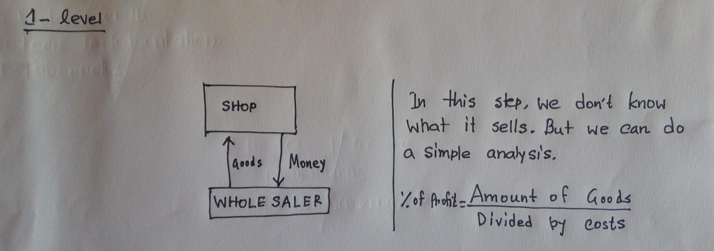

# Clean Architecture Python

## TOC

- [Software Architecture](#software-architecture)
  - [Analogy](#analogy)

### Software Architecture

An architecture can have multiple granularities, which are the “zoom level” we use to look at the components and their connections. The first level is the one that describes the whole process as a black box with inputs and outputs. At this level we are not even concerned with components, we don’t know what’s inside the system and how it works. We only know what it does.

As you zoom in, you start discovering the details of the architecture, that is, which components are in the aforementioned black box and how they are connected. These components are in turn black boxes, and you don’t want to know specifically how they work, but you want to know what their input and outputs are, where the inputs come from, and how the outputs are used by other components.

#### Analogy

Let's consider a Shop. First we will start from higher level (top-level), we will call it zero level and then we will zoom more and dive into further.

- **Zero Level** - A shop, as a black box, is a place where people enter with money and exit with items. The input of the system are people and their money, and the outputs are the same people and items.

  

- **Zoom In** - The shop itself needs to buy what it sells first, so another input is represented by the stock the shop buys from the wholesaler and another output by the money it pays for them. At this level the internal structure of the shop is unknown, we don’t even know what it sells. We can however already devise a simple performance analysis, for example comparing the amount of money that goes out (to pay the wholesaler) and the amount of money that comes in (from the customers). If the former is higher than the latter the business is not profitable.

  

- **More Zoom In** - Even in the case of a shop that has positive results we might want to increase its performances, and to do this chances are that we need to understand its internal structure and what we can change to increase its productivity. This may reveal, for example, that the shop has too many workers, that are underemployed waiting for clients because we overestimated the size of the business. Or it might show that the time taken to serve is too long and many clients walk away without buying anything. Or maybe there are not enough shelves to display goods and the staff carries stock around all day searching for display space so the shop is in chaos and clients cannot find what they need.

At this level, however, workers are pure entities, and still we don’t know much about the shop. To better understand the reasons behind a problem we might need to increase the zoom level and look at the workers for what they are, human beings, and start understanding what their needs are and how to help them work better.
